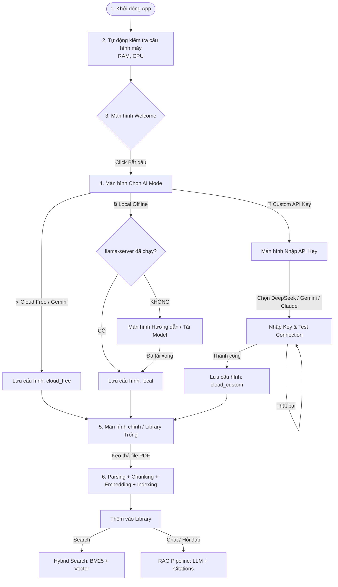

# 🎨 UX Flow & Screen-by-Screen Setup: ResearchMind VN

Tài liệu này chi tiết hóa luồng trải nghiệm người dùng (UX Flow) từ khi khởi động ứng dụng lần đầu (Onboarding) cho đến khi bắt đầu làm việc với các tài liệu nghiên cứu. Chiến lược cốt lõi ở đây là **"Giảm tối đa ma sát (Zero-Friction)"** để bất kỳ ai cũng có thể bắt đầu sử dụng AI chỉ sau 1-2 click chuột.

---

## 🗺️ Mermaid Flowchart: Luồng tổng thể

---

## 🖥️ Chi tiết từng Màn hình (Screen-by-Screen Design)

### 🟢 Màn hình 1: Chào mừng & Auto-Detect Specs
* **Mục tiêu:** Tạo ấn tượng đầu tiên đáng tin cậy (premium, bảo mật) và ngầm kiểm tra cấu hình phần cứng của user để đưa ra gợi ý phù hợp nhất.
* **UX Copy & UI Layout:**
  * **Logo:** Biểu tượng não bộ sáng rực bằng Gradient ánh tím/xanh dương ([IconBrain](file:///d:/all_my_project/memoryOS/apps/desktop/src/components/Icons.tsx)).
  * **Tiêu đề:** `Chào mừng đến với ResearchMind VN`
  * **Mô tả:** `Trợ lý AI giúp bạn tìm kiếm và phân tích tài liệu nghiên cứu. Mọi dữ liệu đều ở trên máy bạn. 🔒`
  * **Bảng thông số (Tự động phát hiện):**
    * 🖥️ RAM: `8 GB` (hoặc cấu hình thực tế)
    * ⚡ CPU Cores: `8 cores`
  * **Gợi ý tự động (Soft Suggestion):**
    * Nếu RAM >= 16GB: Hiện dòng chữ xanh lá `Cấu hình máy của bạn rất tốt để chạy AI Offline cục bộ.`
    * Nếu RAM < 16GB: Hiện dòng chữ nhẹ nhàng `Được khuyên dùng: Sử dụng chế độ Cloud Free để mượt mà nhất.`
  * **Nút hành động:** `Bắt đầu →` (Dẫn sang Màn 2)

---

### 🟡 Màn hình 2: Chọn AI Mode (Trái tim của Onboarding)
* **Mục tiêu:** Giới thiệu rõ ràng 3 lựa chọn để người dùng không cảm thấy mông lung, giảm thiểu rủi ro từ bỏ app vì thiết lập quá phức tạp.
* **Layout:** Chia làm 3 thẻ lớn cạnh nhau (Card Layout):

#### Thẻ 1: ⚡ Cloud Free (Khuyên dùng mặc định)
* **Icon:** Tia chớp gradient vàng/cam.
* **Tiêu đề:** `Cloud Free (Gemini Free)`
* **Chi tiết:** 
  * Chạy ngay không cần cài đặt.
  * Giới hạn 10 câu hỏi/ngày.
  * Phù hợp để dùng thử / MVP nhỏ.
* **Badge:** `Khuyên dùng`
* **Hành động:** 1-Click chọn và vào thẳng App.

#### Thẻ 2: 🔑 Custom API Key
* **Icon:** Chìa khóa vàng.
* **Tiêu đề:** `Custom API Key`
* **Chi tiết:**
  * Sử dụng không giới hạn.
  * Tự nạp và trả chi phí API riêng (rất rẻ).
  * Hỗ trợ Gemini, DeepSeek, Claude.
* **Hành động:** Chuyển sang **Màn hình 3a (Nhập Key)**.

#### Thẻ 3: 🔒 Offline Cục Bộ
* **Icon:** Khóa bảo mật xanh lá.
* **Tiêu đề:** `Offline Cục Bộ`
* **Chi tiết:**
  * Bảo mật tuyệt đối.
  * Không cần internet.
  * Tải và chạy model (~5GB).
* **Hành động:** Chuyển sang **Màn hình 3b (Cài đặt Offline)**.

---

### 🔵 Màn hình 3a: Nhập API Key (Nếu chọn Custom API Key)
* **Mục tiêu:** Cho phép người dùng cấu hình key riêng nhanh chóng kèm liên kết lấy key.
* **Giao diện:** Tab nhỏ lựa chọn: `DeepSeek (Rẻ)` | `Gemini (Nhanh)` | `Claude (Mạnh)`.
* **Fields:**
  * Input Key: Có nút ẩn/hiện key (`🙈` / `👁️`).
  * Link hướng dẫn: 
    * Với DeepSeek: `Lấy API key tại platform.deepseek.com (nạp ~2$ dùng thoải mái) →`
    * Với Gemini: `Lấy API key miễn phí tại aistudio.google.com →`
  * Nút `Xác nhận & Kiểm tra kết nối`: Hệ thống sẽ gửi một truy vấn siêu nhẹ (ping request) lên backend để kiểm tra xem API key có hợp lệ không.
    * **Thành công:** Tự động chuyển sang Màn hình hoàn tất.
    * **Thất bại:** Hiện viền đỏ + dòng báo lỗi chi tiết (ví dụ: `Sai API Key hoặc lỗi mạng. Xin vui lòng kiểm tra lại.`).

---

### 🟣 Màn hình 3b: Cài đặt Local (Nếu chọn Offline Cục Bộ)
* **Mục tiêu:** Giúp người dùng cài đặt llama-server mà không cần hiểu biết sâu về kỹ thuật.
* **Quy trình giảm ma sát:**
  1. Backend check cổng `8080` của llama-server.
  2. **Nếu đã chạy llama-server:** Hiện thông báo kết nối thành công với model đã cấu hình.
  3. **Nếu chưa chạy llama-server:** 
     * Hiện hướng dẫn 1-click tải/mở llama-server: `Tải GGUF model tại HuggingFace và chạy: llama-server.exe -m Qwen3-4B-Q4_K_M.gguf -c 2048 --port 8080`.
     * Cung cấp nút `Kiểm tra lại kết nối` sau khi user đã bật llama-server.

---

### ⚪ Màn hình 4: Màn hình chính trống (Library Empty State)
* **Mục tiêu:** Hướng dẫn hành động đầu tiên sau khi cài đặt thành công: **Nạp tài liệu**.
* **UI Layout:**
  * Một khu vực Drag-and-Drop cực lớn ở giữa màn hình (Dotted Border, màu tím nhạt/indigo).
  * **Hình ảnh/Icon:** File PDF với mũi tên tải lên sinh động.
  * **Chữ chỉ dẫn:** `Kéo và thả tài liệu PDF vào đây hoặc bấm để chọn file.`
  * **Gợi ý phụ:** `Hỗ trợ các file paper định dạng .pdf. Hệ thống sẽ tự động trích xuất nội dung, chia nhỏ và lập chỉ mục tìm kiếm thông minh.`

---

## ⚙️ Thiết kế Luồng Xử lý ngầm (Background Logic)

### 1. Khi Import PDF
* **Bước 1 (Parsing):** Trích xuất text từ các trang PDF trên máy.
* **Bước 2 (Chunking):** Chia nhỏ văn bản thành các đoạn (chunks) khoảng `512` ký tự để RAG hoạt động tối ưu.
* **Bước 3 (Embedding):** Dùng model `BAAI/bge-m3` cục bộ để chuyển text thành vector đa chiều.
* **Bước 4 (Indexing):** Lưu text vào SQLite và lưu vector vào ChromaDB.

### 2. Khi Search (Tìm kiếm)
* Áp dụng **Hybrid Search**:
  * **BM25 Search:** Tìm kiếm từ khóa chính xác (Keyword matching) để giữ độ chuẩn xác cao cho thuật ngữ khoa học.
  * **Vector Search:** Tìm kiếm ngữ nghĩa (Semantic search) để hiểu câu hỏi người dùng kể cả khi dùng từ đồng nghĩa.
  * **RRF (Reciprocal Rank Fusion):** Gộp 2 kết quả trên lại và sắp xếp thứ tự phù hợp nhất.

### 3. Khi Chat (Hỏi đáp kèm trích dẫn)
* **Prompt Engineering:** Backend tự động gom đoạn Context tìm được từ tài liệu và ghép vào prompt của LLM.
* **Citations logic:** Yêu cầu LLM trích xuất nguồn bằng định dạng chuẩn `[Tên tác giả / Tên file, trang X]`. Giao diện frontend phân tích định dạng này và hiển thị link clickable để user nhảy trực tiếp tới trang tài liệu đó trong thư viện.
